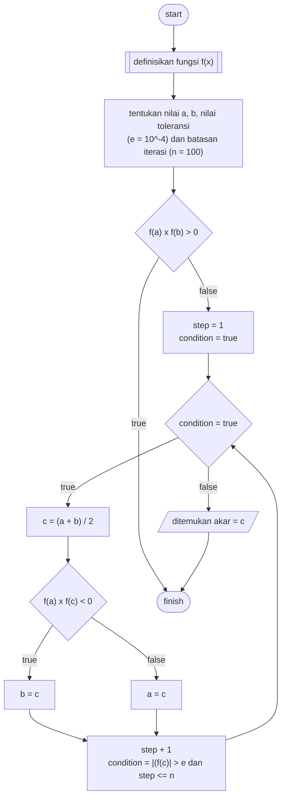

# Algorithm

ALGORITMA **PROGRAM_PENCARIAN_AKAR_BISEKSI**

DEKLARASI:

- step : integer = 1
- condition : boolean = true
- a : integer
- b : integer
- c : integer
- e : float = 0.0001 // nilai toleransi
- n : integer = 100 // batasan iterasi

DESKRIPSI:

```
read(a, b)

if f(a) x f(b) > 0 then
  print('nilai harus diantara akar')
else
  while condition = true do
    c <- (a + b) / 2

    if f(a) x f(c) < 0 then
      b <- c
    else
      a <- c
    end if

    step <- step + 1

    if (|f(c)| > e) and (step <= n) then
      condition <- true
    else
      condition <- false
    end if
  end while

  print('akar ditemukan: ', c)
end if
```

# Flowchart


