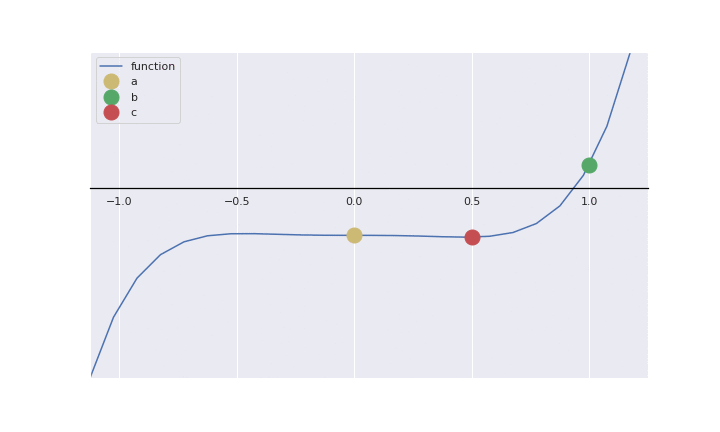

# Task #1

## Assignment:

1. Cari akar persamaan / polinomial untuk pangkat ganjil (3, 5, 7, ...) konstanta
   masing-masing dua desimal dibelakang koma. Contoh: 
   f(x) = 8.56x^3 - 1.22x^2 - 3.47

2. Persamaan harus berbeda (jika ada yang sama, dianggap tidak mengumpulkan tugas)

3. Gunakan metode tabel dan biseksi (lihat di ebook dan youtube)!

4. Kerjakan dengan excel dan python!

5. File yang dikumpulkan:
   - Algoritma metode biseksi dan flowchartnya (tulis tangan dalam bentuk pdf/jpg)
   - Script program python dan outputnya (docx)
   - Tabel dan grafik (xls/xlsx)

## Submission:

$$
\begin{equation}
f(x) = 2.99x^5-1.12x^3-1.26
\end{equation}
$$

- Algorithm & flowchart [see here](./algorithm.md)
- Python script [here](./bisection.py)
- Animated graphics in python I also made, [here!](./animation.py)
- Jupyter notebook [are here](./bisection.ipynb) too
- Excel file with graph method, [download this!](./table.xlsx)
- Excel file with bisection method, [here](./bisection.xlsx)

